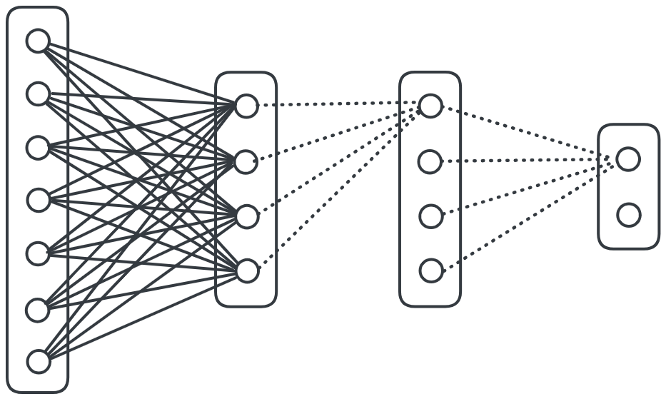

# SimpleNeuralNetwork

<picture>
  <source srcset="./assets/network_diagram_light.png" media="(prefers-color-scheme: light)"/>
  <source srcset="./assets/network_diagram_dark.png"  media="(prefers-color-scheme: dark)"/>
   <!-- default -->
</picture>

This project is a showcase on how to build and train a simple neural network on images of handwritten digits. It is coded in Python 3.12 using basic libraries like Numpy and Pandas.

This was inspired by 3blue1brown's series on the subject: find it [here](https://youtu.be/aircAruvnKk?si=2ADANgQrMpzmQACh). In turn his series is based on a project and book by [Michael Nielsen](https://github.com/mnielsen/neural-networks-and-deep-learning/). I used the data_loader.py file from his project and downloaded the dataset from his repo. I encourage you to go through his repo since he has more than one network architecture.

Presentation PDF file in `assets\presentation.pdf` or click [here](https://github.com/Huraqan/SimpleNeuralNetwork/blob/main/assets/presentation.pdf)

# Usage

Explore the concept of neural networks by getting your hands dirty. See the code and maths for the feed-forward and back-propagation algorithms. Tinker with settings to get improved results. Expand upon the project by implementing convolution, a fantastic way to get valuable information about a pixel's neighborhood, allowing for the network to better differentiate certain patterns.

# Installation

- Use `pip install -r requirements.txt` to get necessary libs.
- Unzip `mnist.gz` by running the first two cells of the setup notebook, the resulting `mnist.pkl` is the pickled dataset.

# Getting started

You can start playing around with `playground.ipynb`, a notebook where you can freely train and inspect your current model.

If you want to do some analysis on the validation reports, a notebook named `analysis.ipynb` has been prepared.

The network itself is composed of two files:
- SimpleNeuralNetwork.py
- Layer.py

This project has been set up to accomodate two output shapes: (10, 1) and (11, 1). The first ten elements correspond to each digit. The eleventh element represents the "noise" category.

I noticed that training the model to recognize noise will slightly degrade performance on the digits. However, I did find it fascinating that the model is in fact better at recognizing random noise than it is at distinguishing digits. But recent discussions about the noise category have brought me to believe that the network is likely using the outer pixels to distinguish noise from the MNIST data. Probably because the digits only have black pixels at the edges.